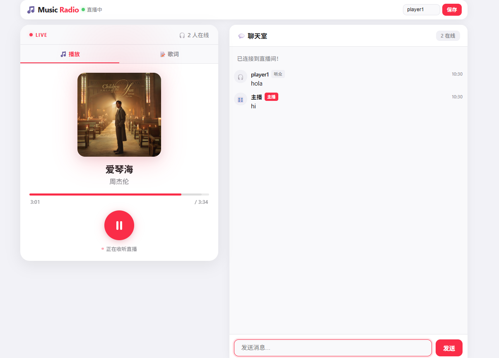
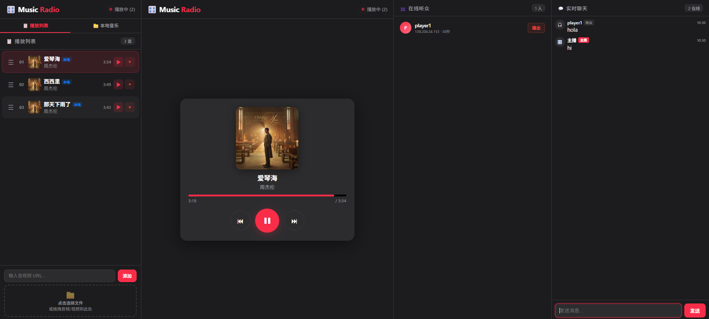

# 🎧 Music Radio Station

> 自建实时音乐电台系统 — FastAPI + WebSocket，支持 DJ 控制台 + 听众同步收听


[](https://fm.yuhanghome.icu/)

---

## ✨ 特性

- 🎵 **三种曲目来源** — 上传文件 / URL 添加 / 本地音乐目录浏览
- 📡 **WebSocket 实时同步** — 听众端自动跟随 DJ 播放，零延迟切换
- 🔄 **服务端驱动循环播放** — 歌曲播完自动切下一首，DJ 关页面也不停
- 📊 **边下边播** — HTTP Range 请求流式传输，支持 seek
- 🎤 **多源歌词搜索** — LRCLIB / 网易云音乐，支持同步歌词 (LRC)
- 🖼️ **封面自动提取** — 支持 MP3/M4A/FLAC/OGG/WMA 内嵌封面
- 🗑️ **定时清理** — 每日 00:00 自动清理上传缓存，播放中跳过
- 🎛️ **DJ 控制台** — 播放控制、播放列表拖拽排序、在线听众管理、踢人
- 💬 **实时聊天** — 听众和主播即时互动
- 📱 **移动端适配** — 响应式布局，触控优化
- 🌙 **Apple Music Night 主题** — 深色玻璃态 UI

## 📸 截图

| 听众播放页 | DJ 控制台 |
|:---:|:---:|
|  |  |

> 🎧 **在线体验**：[https://fm.yuhanghome.icu/](https://fm.yuhanghome.icu/)

## 🚀 快速开始

### 安装依赖

```bash
pip install -r requirements.txt
```

### 启动服务

```bash
python server.py
```

### 访问

| 页面 | 地址 |
|------|------|
| 🎧 听众播放页 | `http://localhost:8765/player` |
| 🎛️ DJ 控制台 | `http://localhost:8765/admin` |

## 📁 项目结构

```
music-radio/
├── server.py              # FastAPI 后端（所有 API + WebSocket）
├── requirements.txt       # Python 依赖
├── API.md                 # 完整 API 文档
├── DEPLOY_GUIDE.md        # 部署指南
├── .gitignore
├── static/
│   ├── player.html        # 听众播放页
│   └── admin.html         # DJ 控制台
└── uploads/
    ├── music/             # 上传的音乐文件（运行时生成）
    └── covers/            # 提取的封面图（运行时生成）
```

## 🔧 配置

### Admin 密码

修改 `server.py` 中的 `ADMIN_PASSWORD_HASH`：

```python
ADMIN_PASSWORD_HASH = _hash_pwd("your_password")
```

### 本地音乐目录

修改 `server.py` 中的 `LOCAL_MUSIC_DIR`：

```python
LOCAL_MUSIC_DIR = Path("/path/to/your/music")
```

## 🌐 部署

### Nginx 反向代理配置

```nginx
server {
    listen 443 ssl;
    server_name fm.example.com;

    location / {
        proxy_pass http://127.0.0.1:8765;
        proxy_set_header Host $host;
        proxy_set_header X-Real-IP $remote_addr;
        proxy_set_header X-Forwarded-For $proxy_add_x_forwarded_for;
        proxy_set_header Upgrade $http_upgrade;
        proxy_set_header Connection $connection_upgrade;
        client_max_body_size 100m;
    }
}

# WebSocket 支持（http 块中添加）
map $http_upgrade $connection_upgrade {
    default upgrade;
    ''      close;
}
```

### Systemd 服务（可选）

```ini
[Unit]
Description=Music Radio Station
After=network.target

[Service]
Type=simple
User=www
WorkingDirectory=/path/to/music-radio
ExecStart=/path/to/venv/bin/python server.py
Restart=always

[Install]
WantedBy=multi-user.target
```

## 📡 API 概览

| 分类 | 端点 | 说明 |
|------|------|------|
| 播放控制 | `POST /api/playback/play` | 恢复播放 |
| | `POST /api/playback/pause` | 暂停 |
| | `POST /api/playback/next` | 下一首 |
| | `POST /api/playback/prev` | 上一首 |
| | `POST /api/playback/seek` | 跳转位置 |
| | `POST /api/playback/play-index` | 播放指定曲目 |
| 播放列表 | `GET /api/playlist` | 获取列表 |
| | `POST /api/playlist/add` | URL 添加 |
| | `DELETE /api/playlist/{id}` | 删除曲目 |
| | `PUT /api/playlist/reorder` | 重新排序 |
| 文件上传 | `POST /api/upload/music` | 上传音频 |
| | `POST /api/upload/cover/{id}` | 上传封面 |
| 本地音乐 | `GET /api/local-music/browse` | 浏览目录 |
| | `POST /api/local-music/add` | 添加到列表 |
| 歌词搜索 | `GET /api/lyrics/search` | 多源搜索 |
| 用户管理 | `GET /api/users` | 在线列表 |
| | `POST /api/users/kick` | 踢出用户 |
| 实时通信 | `WS /ws` | WebSocket 双向通信 |

👉 **完整 API 文档**：[API.md](./API.md)

## 🛠️ 技术栈

- **后端**：Python · FastAPI · WebSocket · mutagen
- **前端**：原生 HTML/CSS/JS（零框架依赖）
- **通信**：WebSocket 实时双向通信
- **音频**：HTTP Range 流式传输（边下边播）

## 📄 License

MIT License